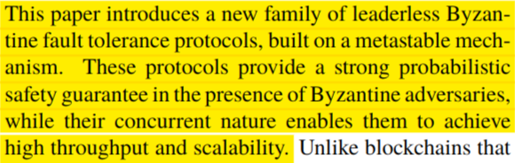
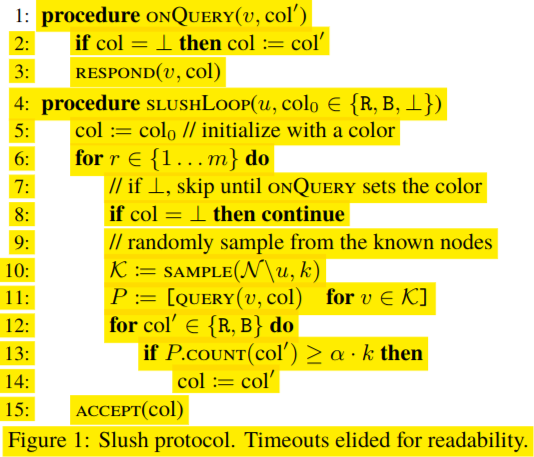

# Overview

This is a PDF annotation export system that uses PDF.js, and chrome headless to
extract annotations from PDF files.

The hard requirement is for **high fidelity** exports which (a) preserve all the
formatting, (b) have 100% precision, (c) 100% recall, (d) include all annotation
types, (e) include screenshots of the originals, and (f) extract original markup
as HTML or SVG that can be used natively in other tools.

# What works:

- I can paste poc.js into a PDF.js loaded PDF and it's able to export the text and
  also the image of the highlighted text.

- Exporting the entire page as a PNG

- Finding the box coordinates around the highlight.

- Extracting the text...

- Use a standalone PDF.js that I call directly.

- Input and output to files from the command line.

# What remains:

- package it in a docker container on Linux as the dependencies are kind of harsh

- clean up the npm dependencies

- fix some alignment issues on various highlights.

- fix some last minute FIXMEs in the code.

- generated screenshots of highlights don't look as crisp as they do on screen.
  Numerous people have complained that the resolution of these screenshots
  is fixed at 96 DPI but I need to see how this manifests itself as I don't
  understand how that's impacting the output

## Text extracted

It's able to properly export the text:

```json
  "linesOfText": [
    "This paper introduces a new family of leaderless Byzan-",
    "tine fault tolerance protocols, built on a metastable mech-",
    "anism.  These protocols provide a strong probabilistic",
    "safety guarantee in the presence of Byzantine adversaries,",
    "while their concurrent nature enables them to achieve"
  ],

```

## Image

It's able to properly export an image too:

# What's next

- other types of annotations.

- annotations with user entered text.

- connect it up with chrome headless to run from the command line

- use the PDF.js API ourselves. Don't rely on the demo PDF.js

- compute the scale ourselves

- take screenshots at 400% so the font resolution is high

# What I need help on?

- Is there a reliable way to extract the HTML with all the formatting for the PDF
  to be embedded elsewhere in an iframe?  Some type of data URL of encoded
  HTML would be ideal.

# Example:

## Highlight of a normal paragraph



## Highlight using mathematical notation



